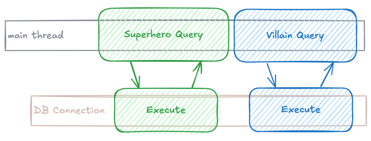
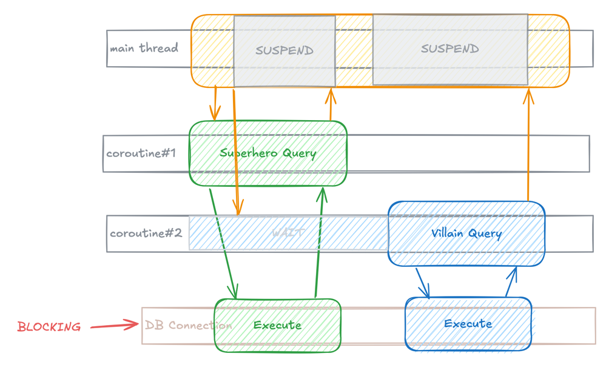
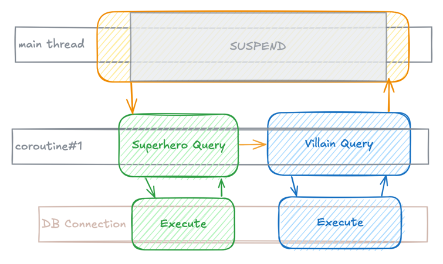
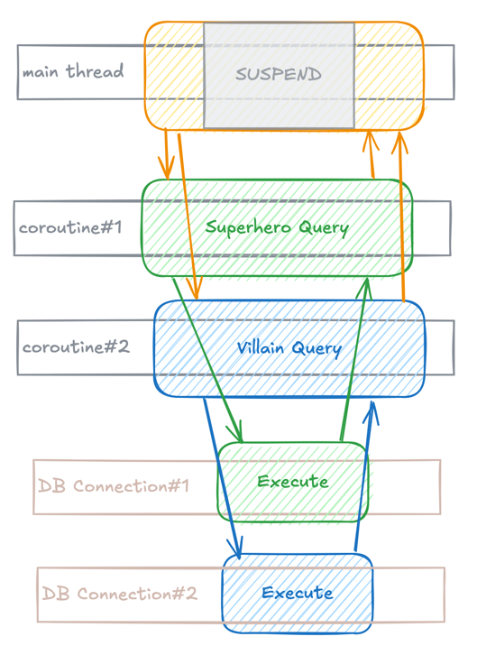

# Coroutine support in Kapper 1.1

When I set out to build Kapper, I wanted it to be the most Kotlin idiomatic micro ORM, with the goal that it should be intuitive to use by Kotlin users while still being useful for Java developers.
While Kapper 1.0 achieved many of these goals, one obvious gap was the lack of support for Kotlin Coroutines – a feature now being addressed in Kapper 1.1 with the introduction of the `kapper-coroutines` module.

## Using Kapper Coroutines

The `kapper-coroutines` module is available from [Maven Central](https://central.sonatype.com/artifact/net.samyn/kapper-coroutines/versions) and adds support for coroutines to Kapper.

At its core, Kapper coroutines are supported by a single extension function: `withConnection` on the `DataSource` object.
This function creates a new connection, executes the provided lambda within a coroutine scope, and automatically closes the connection when complete.

By default, this code, including the Kapper API _query_ or _execute_ functions, will use the `Dispatchers.IO` dispatcher, but another dispatcher can be provided as an optional parameter.
The `Dispatchers.IO` dispatcher is specifically optimized for input/output operations like database queries and file operations. It maintains a pool of threads that can be used for blocking operations, ensuring that your application remains responsive while executing these potentially time-consuming tasks.

### Some Examples

Let's start with the basics of including and using the module, then move on to more complex scenarios that demonstrate the power of coroutines.

Start by including the `kapper-coroutines` module in your project, for example:

```kotlin
 dependencies {
     implementation("net.samyn:kapper-coroutines:1.1.0")
 }
```

Let's look at a more complex example using different coroutine builders:

- `runBlocking`: Creates a coroutine scope and blocks the current thread until all launched coroutines complete.
- `async`: Launches a new coroutine that can return a result using await().

Here's how these work together:

```kotlin
// Create a DataSource object, for example using [HikariCP](https://github.com/brettwooldridge/HikariCP)
//  Kapper is un-opinionated about which pooler, if any, you use.
val dataSource = HikariDataSource().apply {
    jdbcUrl = "jdbc:PostgreSQL://localhost:5432/mydatabase"
    username = "username"
    password = "password"
}

// The Kapper API exposes a `withConnection` extension function which can be used instead of the `connection` function.
dataSource.withConnection { connection ->
    try {
        // The connection can be used to execute queries, using the Kapper API or the native JDBC api.
        connection.autoCommit = false
        connection.query<SuperHero>("SELECT * FROM super_heroes where id = :id", "id" to 1)?.also { hero ->
            connection.execute(
                "INSERT INTO other_super_heroes (id, name, email) VALUES (:id, :name, :email)",
                "id" to hero.id,
                "name" to hero.name,
                "email" to hero.email,
            )
        }
        connection.commit()
    }
    catch (e: SQLException) {
        connection.rollback()
        throw e
    }
}
```

The above code snippet demonstrates how using the `withConnection` function:

- A `DataSource` object is created using a connection pooler (in this case, HikariCP).
Using a connection pooler is optional but usually recommended.
- The `withConnection` function is called on the `DataSource` object to obtain a connection from the pool.
- A JDBC transaction is started by setting `autoCommit` to `false`.
- A query is executed using the Kapper API to select a single `SuperHero` object.
- An insert statement is executed using the Kapper API to insert the `SuperHero` object into a different table.
- The transaction is committed if no exceptions are thrown, or rolled back if an exception occurs.

The only notable thing about this code is that `withConnection` is a suspending function, so it can be called from within a coroutine scope.
This means that, for example, the main thread does not need to be blocked and can therefore continue to do other work while the database query is being executed.

For example:

```kotlin
runBlocking {
    val selectJob =
        async {
            println("[${Thread.currentThread().name}] Starting to select heroes.")
            val heroes = it.query<SuperHero>("SELECT * FROM super_heroes")
            println("\n[${Thread.currentThread().name}] Finished selecting heroes")
            heroes
        }
    val logJob =
        launch {
            // print . until the insertJob has completed.
            println("[${Thread.currentThread().name}] ")
            while (selectJob.isActive) {
                delay(100)
                println(".")
            }
        }
    println("Selected ${selectJob.await().joinToString { it.name }}")
    logJob.join()
}
```

In this example, if the select query would be slow, we can expect the output to be something like:

```
[Test worker @coroutine#5] Starting to select heroes.
[Test worker @coroutine#6] ...........
[Test worker @coroutine#5] Finished selecting heroes
Selected Superman, Batman, Wonder Woman, Spider-Man, Iron Man, Captain America, Thor
```

We can see that we were able to continue logging to the console until the select query completed.

## A single suspending function

### Why not suspend everything?

Some may wonder why Kapper only exposes a single suspending function, `withConnection`.
Why, for example, are there no suspending versions of the `query` or `execute` functions?

A deepdive into coroutines is outside the scope of this blog post, and I can thoroughly recommend a read of [Blocking threads, suspending coroutines](https://elizarov.medium.com/blocking-threads-suspending-coroutines-d33e11bf4761) by Roman Elizarov.
However, I want to try to explain with some simple diagrams why a function to create a connection is the best API to expose as a suspending function.

### Understanding sequential execution

Firstly consider what happens when we don't use coroutines for the following code:

```kotlin
connection.use { 
    it.query<SuperHero>("SELECT * FROM super_heroes")
    it.query<Villain>("SELECT * FROM villains")
}
```

We can visualise this like so:



Using a single DB connection, both queries are executed sequentially, i.e. the second query executed once the first one has completed, and the main thread is blocked until both queries have completed.

### The problem with suspending queries

Imagine the query function was suspendable, we could write the following code:

```kotlin
connection.use {
    val first = async { it.query<SuperHero>("SELECT * FROM super_heroes") }
    val second = async { it.query<Villain>("SELECT * FROM villains") }
    awaitAll(first, second)
}
```

### The Kapper approach

This may seem like it would allow the queries to execute concurrently, however, let's have a look at the execution model:



What is going on here is that 2 coroutines are created, but the JDBC operations are blocking, which means that each of the queries, when executing using the same connection, will execute sequentially.

This means one of the coroutines will be waiting, suspended, until the other one completes. The end result is that the queries are still executed sequentially, but with the overhead of creating 2 coroutines.

The end result is that the queries are still executed sequentially, but with the overhead of creating 2 coroutines.

This is why Kapper takes the approach of providing a suspending function to create a connection, which can then be used to execute queries in a coroutine scope, re-enforcing that multiple queries using the same connection will always be executed sequentially.

For example:

```kotlin
val queries = async datasource.withConnection {
  it.query<SuperHero>("SELECT * FROM super_heroes")
  it.query<Villain>("SELECT * FROM villains")
}
queries.await()
```

In this case, a coroutine is created, which by default will be using the `Dispatchers.IO` dispatcher, and the queries will be executed sequentially:



## Running queries concurrently

As seen above, it is important to recognise that JDBC operations are blocking, and that using the same connection for multiple queries will result in them being executed sequentially.

To execute queries concurrently, you will need to use a separate connection for each query.
This can be done easily using the Kapper API:

```kotlin
val query1 = async datasource.withConnection {
  it.query<SuperHero>("SELECT * FROM super_heroes")
}
val query2 = async datasource.withConnection {
  it.query<Villain>("SELECT * FROM villains")
}
awaitAll(query1, query2)
```

In this case, each query is executed in its own coroutine, using its own connection, and will be executed concurrently:



There are a few important things to note when doing this:

- Each connection will be obtained from the connection pool (or the database directly of no pool is used), so it is important to ensure that the pool is configured to handle the number of connections required.
Database connections are a relatively expensive resource, so it is important to ensure that they are used efficiently.
- Database transactions are tied to a connection, so if you need to execute multiple queries within a transaction, they have to use the same connection, and in Kapper that means the same coroutine.

## Conclusion

Kapper 1.1 adds support for Kotlin Coroutines, making it easier to use Kapper in a coroutine-based application.
This integration brings several key benefits:

- Non-blocking database operations that keep your application responsive.
- Simple, intuitive API with the `withConnection` function.
- Clear separation between sequential and concurrent query execution.
- Automatic resource management with proper connection handling.
- Seamless integration with existing coroutine-based applications.

It is however important to understand that JDBC operations are blocking, and the impact this has on the execution of queries in a coroutine scope.
By following the patterns described in this post, you can effectively manage your database connections while taking advantage of Kotlin's powerful coroutine features.

Please check out the [Kapper](https://github.com/driessamyn/kapper) and [Kapper-Example](https://github.com/driessamyn/kapper-examples) repositories for more information and examples, and let me know what you think.
