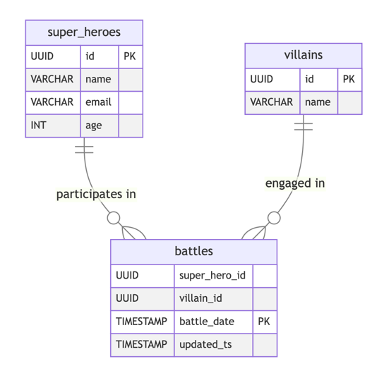

# Kapper benchmarks - how does Kapper 1.3 compare to the competition?

Kapper is a lightweight Kotlin ORM library designed to be simple and idiomatic.
Unlike other ORM libraries, such as Hibernate and Ktorm, Kapper avoids being a leaky abstraction over SQL.
Instead, it embraces SQL as the optimal language for database operations, offering a straightforward, idiomatic API to reduce boilerplate code.

But how does Kapper's performance measure up against its competitors?

## TL;DR

I recently benchmarked Kapper 1.3 against raw JDBC, Hibernate, and Ktorm as a precursor to optimization work.
I feared disappointing results, especially given the potential for improving its reflection-based mapping.
However, the outcomes were better than expected:

- Kapper pretty much matches _raw_ JDBC performance when using manual mapping.
- Auto-mapping introduces a small penalty of a few microseconds per conversion.
While this is slightly slower than Hibernate, it is significantly faster than Ktorm.
- Optimizing the reflection-based mapper is less urgent than initially anticipated.

## Benchmarking

Benchmarking is often divisive, so I’ve taken care to be transparent about the methodology and results.

The goal of these benchmarks wasn’t to measure Kapper’s absolute performance but to evaluate its relative performance against other libraries.
I used the [Java Microbenchmark Harness](https://github.com/openjdk/jmh) (JMH), a trusted tool for JVM-based microbenchmarks, which accounts for pitfalls like dead code elimination, constant folding, and JVM warm-up.

I tested the latest library versions at the time of writing:

- **Kapper**: 1.3.0
- **Hibernate**: 6.6.11
- **Ktorm**: 4.1.1

The benchmark code resides in Kapper’s `benchmark` module, and I’ve published the results [here](https://github.com/driessamyn/kapper-benchmark-results/tree/kapper-1.3-results/results/1.3).

### Environment

Benchmarks ran on an M3 MacBook Air (16GB RAM).
While a dedicated server with a fixed configuration would be more ideal, this setup suffices for relative performance comparisons.
Tests were repeated multiple times to minimize outliers.
If anyone wants to sponsor a dedicated benchmarking environment, let me know! 😉

### Benchmarking Process

The benchmark suite consisted of the following elements:

- **`BenchmarkStrategy` interface**: Specifies methods to benchmark for each library:
  - `findById`: Select a single row by ID and map it to a DTO.
  - `find100Heroes`: Select 100 rows and map them to a DTO.
  - `findHeroBattles`: Execute a join query and map the results to a DTO.
  - `insertNewHero`: Insert a single row into a table.
  - `updateHero`: Update a single row in a table.
- **Library Implementations**:
  - Two strategies for Kapper: one with auto-mapping and one with manual mapping.
  - Hibernate and Ktorm implementations.
- `KapperBenchmark`: Runs benchmarks for each strategy, exercising all interface methods.

Each benchmark was tested against both PostgreSQL and SQLite (in-memory) databases.
SQLite tests minimized I/O latency, focusing on library performance.
However, this article focuses on PostgreSQL results for realism.

The database schema included three tables modeling superheroes, villains, and battles.



### JMH Parameters

- `forks=3` - The 'forks' parameter instructs JMH to run each benchmark in 3 separate JVM instances.
This provides more reliable results by mitigating the effects of JVM-specific optimizations and ensures the benchmarks aren't influenced by artifacts from previous benchmark runs.
- `iterations=5` - Each benchmark is executed 5 times in succession within each fork.
This helps to establish statistical confidence in the results by providing multiple measurement samples.
- `time_on_iteration="5s"` - Each iteration runs for 5 seconds, during which JMH collects multiple measurement samples.
This longer measurement window helps smooth out any momentary performance fluctuations.
- `warmup_time="2s"` - Before the actual measurement begins, JMH runs the benchmark for 2 seconds to 'warm up' the JVM.
This ensures that the JVM's just-in-time compiler has had time to optimize the code, simulating the steady-state performance that would be experienced in a real application rather than measuring cold-start performance.

## The Results

### Find by ID


```csv
Benchmark                        (databaseType)          (library)  Mode  Cnt     Score     Error  Units
KapperBenchmark.findById             POSTGRESQL               JDBC  avgt   15    50.736 ±   0.403  us/op
KapperBenchmark.findById             POSTGRESQL             KAPPER  avgt   15    55.228 ±   0.380  us/op
KapperBenchmark.findById             POSTGRESQL  KAPPER-NO-AUTOMAP  avgt   15    51.910 ±   0.192  us/op
KapperBenchmark.findById             POSTGRESQL          HIBERNATE  avgt   15    53.530 ±   0.528  us/op
KapperBenchmark.findById             POSTGRESQL              KTORM  avgt   15   709.320 ± 175.702  us/op
```

For this benchmark, a single row is selected from one database table, selected by ID (its primary key).
The record is then converted to a DTO, a Kotlin data class in this case.

Kapper’s manual mapping matches _raw_ JDBC, incurring only a 1-2 microsecond penalty.
Auto-mapping adds a ~5 microsecond overhead but remains competitive with Hibernate.
Ktorm lags significantly, averaging 12x slower than Kapper’s auto-mapping.

### Select 100 records


```csv
Benchmark                        (databaseType)          (library)   Mode  Cnt     Score     Error  Units 
KapperBenchmark.find100              POSTGRESQL               JDBC   avgt   15    85.867 ±   0.994  us/op
KapperBenchmark.find100              POSTGRESQL             KAPPER   avgt   15   330.150 ± 155.284  us/op
KapperBenchmark.find100              POSTGRESQL  KAPPER-NO-AUTOMAP   avgt   15    86.755 ±   0.295  us/op
KapperBenchmark.find100              POSTGRESQL          HIBERNATE   avgt   15   123.994 ±   0.964  us/op
KapperBenchmark.find100              POSTGRESQL              KTORM   avgt   15   907.302 ± 139.134  us/op
```

Similar trends emerge when selecting 100 rows.
Kapper’s manual mapping nearly matches raw JDBC.
Auto-mapping adds a performance cost, but Kapper still outperforms Ktorm significantly.

### Selecting data using a simple join


```csv
Benchmark                        (databaseType)          (library)   Mode  Cnt     Score     Error  Units  
KapperBenchmark.simpleJoin           POSTGRESQL               JDBC   avgt   15    91.490 ±   1.017  us/op
KapperBenchmark.simpleJoin           POSTGRESQL             KAPPER   avgt   15    97.432 ±   0.592  us/op
KapperBenchmark.simpleJoin           POSTGRESQL  KAPPER-NO-AUTOMAP   avgt   15    92.780 ±   0.579  us/op
KapperBenchmark.simpleJoin           POSTGRESQL          HIBERNATE   avgt   15   165.602 ±   2.178  us/op
KapperBenchmark.simpleJoin           POSTGRESQL              KTORM   avgt   15  1103.603 ± 760.116  us/op
```

The last variation of the "read" benchmark uses a simple JOIN query to select a single row from 3 tables in the DB:

```sql
SELECT s.name as superhero, v.name as villain, b.battle_date as date
FROM super_heroes as s
INNER JOIN battles as b on s.id = b.super_hero_id
INNER JOIN villains as v on v.id = b.villain_id
WHERE s.id = ? 
```

In this benchmark, Kapper’s manual mapping again matches raw JDBC.
Auto-mapping incurs a small penalty but outperforms Hibernate and significantly outpaces Ktorm.

### Inserting and Updating Records

#### Insert


```csv
Benchmark                        (databaseType)          (library)   Mode  Cnt     Score     Error  Units  
KapperBenchmark.insertSingleRow      POSTGRESQL               JDBC   avgt   15    53.077 ±   0.721  us/op
KapperBenchmark.insertSingleRow      POSTGRESQL             KAPPER   avgt   15    54.457 ±   0.957  us/op
KapperBenchmark.insertSingleRow      POSTGRESQL  KAPPER-NO-AUTOMAP   avgt   15    54.347 ±   0.662  us/op
KapperBenchmark.insertSingleRow      POSTGRESQL          HIBERNATE   avgt   15   162.638 ±   1.792  us/op
KapperBenchmark.insertSingleRow      POSTGRESQL              KTORM   avgt   15   345.546 ± 331.779  us/op 
```

Moving onto the write operations, there are no surprises. Kapper's performance is similar to using _raw_ JDBC.
In this case, there is no difference between the 2 kapper benchmark results, and that is because Kapper does not yet support auto-mapping for the `execute` API.
Hibernate performs around 3 times slower, and Ktorm slower again, however, the difference is less pronounced than for the read benchmarks.

#### Updating a record, the odd one out


```csv
Benchmark                        (databaseType)          (library)   Mode  Cnt     Score     Error  Units   
KapperBenchmark.updateSingleRow      POSTGRESQL               JDBC   avgt   15   707.729 ± 124.671  us/op
KapperBenchmark.updateSingleRow      POSTGRESQL             KAPPER   avgt   15   705.396 ± 118.716  us/op
KapperBenchmark.updateSingleRow      POSTGRESQL  KAPPER-NO-AUTOMAP   avgt   15   705.013 ± 121.060  us/op
KapperBenchmark.updateSingleRow      POSTGRESQL          HIBERNATE   avgt   15   105.266 ±   2.165  us/op
KapperBenchmark.updateSingleRow      POSTGRESQL              KTORM   avgt   15   846.170 ± 166.406  us/op 
```

Results for the last benchmark, updating a single row, has me puzzled. I was expecting these to be very similar to inserting a record, however, it is significantly slower for all libraries, except Hibernate, for which the update is faster than the insert, and more curiously a lot faster even than using _raw_ JDBC.
When seeing these results, I was convinced this was a blib, so repeated the benchmark run a few times to validate, but I am seeing similar results for all.

Curiously, the SQLITE results look more like what I was expecting:

```csv
Benchmark                        (databaseType)          (library)   Mode  Cnt     Score     Error  Units
KapperBenchmark.updateSingleRow          SQLITE               JDBC   avgt   15     2.191 ±   0.032  us/op
KapperBenchmark.updateSingleRow          SQLITE             KAPPER   avgt   15     3.004 ±   0.044  us/op
KapperBenchmark.updateSingleRow          SQLITE  KAPPER-NO-AUTOMAP   avgt   15     3.030 ±   0.018  us/op
KapperBenchmark.updateSingleRow          SQLITE          HIBERNATE   avgt   15     7.319 ±   0.087  us/op
KapperBenchmark.updateSingleRow          SQLITE              KTORM   avgt   15   708.753 ± 175.757  us/op
```

This anomaly warrants deeper investigation.
I've confirmed the benchmark implementation is correct, and the SQLite results support my expectation that updates should perform similarly to inserts.
This PostgreSQL-specific behavior will be the subject of future profiling and analysis, and if Hibernate has some magic sauce here, I will be sure to copy it, but more likely I am missing something.
If anybody has any ideas, let me know ;) 

## Conclusion

Benchmarking kapper was actually a lot of fun, and the JMH library is a great tool for this.
I was fearful of what I would find, but the results are better than I expected, and I am happy to see that Kapper's performance can be on par with _raw_ JDBC.
I was expecting to do some optimisations to the reflection based mapping, and that is still the plan, but this doesn't seem as urgent as I had feared.

What I can take away from this is:

- Kapper's auto-mapper adds a small single digit microsecond penalty.
This is unsurprising given it is using reflection.
For most use-cases, this will be fine given this is very small fraction of the overall "cost" considering the I/O nature of DB operations.
- If performance is critical, and you are using Kapper, then use manual mapping, it is pretty much as fast as _raw_ JDBC but still gives you the benefits of Kapper's API to reduce boilerplate code.
- Hibernate is a little faster than Kapper when using the auto-mapper, but not as fast as when using manual mapping.
It is also much harder to use and suffers from the leaky abstraction issue.
- Ktorm is significantly slower than Kapper and Hibernate.

While Kapper's auto-mapping performance is already quite good, I plan to optimize it further in upcoming releases and welcome community contributions.

There are several ways you can contribute to making Kapper even better:

- Try running these benchmarks on your own systems and share your results
- Review the benchmark code and suggest improvements or additional test cases
- Help investigate the PostgreSQL update performance anomaly
- Consider contributing to Kapper's development, especially if you have experience with performance optimization or code generation
- Share your experiences using Kapper in real-world applications

The more diverse environments and use cases we can test, the more we can refine Kapper to be both performant and developer-friendly.

You can find the benchmark code [here](https://github.com/driessamyn/kapper/tree/main/benchmark) and the results [here](https://github.com/driessamyn/kapper-benchmark-results/).

Join the discussion on GitHub or reach out directly if you're interested in contributing!
