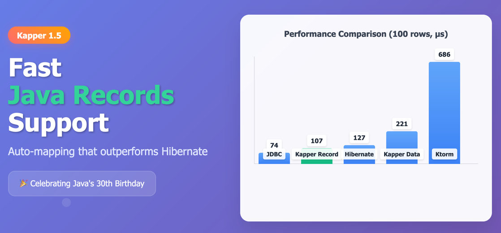

# Kapper 1.5: Celebrating Java's 30th Birthday with Blazing Fast Record Mapping



As Java recently celebrates its 30th birthday this year, I'm excited to announce Kapper 1.5 with first-class support for Java Record classes! 
While Kapper was designed with Kotlin in mind and provides a Kotlin-idiomatic API, support for other JVM languages was always an important objective. 
The addition of Record support emphasizes this commitment to the broader JVM ecosystem.

This release also brings new customization options that make database mapping even more powerful and flexible, while maintaining the blazing-fast performance Kapper is known for.

## 🚀 What's New in Kapper 1.5

### Java Record Support - Fast and Modern

The headline feature of Kapper 1.5 is native support for auto-mapping to Java Record classes. 
Records, introduced in Java 14, provide a concise way to model immutable data - perfect for database entities.

Here's how simple it is to use Records with Kapper:

```java
// Define your record
public record SuperHero(UUID id, String name, String email, int age) {}

// Query a list of heroes
try (Connection conn = dataSource.getConnection()) {
    List<SuperHero> heroes = kapper.query(SuperHero.class, conn, 
        "SELECT * FROM super_heroes", Map.of());
}

// Find a single hero by ID
try (Connection conn = dataSource.getConnection()) {
    SuperHero hero = kapper.querySingle(SuperHero.class, conn, 
        "SELECT * FROM super_heroes WHERE id = :id", 
        Map.of("id", heroId));
}
```

### Custom Mappers for Ultimate Flexibility

When introducing support for Record mappers, I made a change to how mappers are registered.
This opened the door to custom mappers, allowing you to define exactly how your data should be mapped from the database to your objects, which is especially useful for performance critical use cases, or where complex queries or mapping logic is required.
By using custom mappers, you avoid the reflection overhead of auto-mapping, making Kapper even faster than other ORMs in these configurations.

Custom mappers are _just code_, nothing magical, so they are easy to understand, maintain and _test_.

You can register a custom mapper class:

```kotlin
data class SuperHero(val id: UUID, val name: String, val email: String? = null, val age: Int? = null)

// Custom mapper class
class SuperHeroMapper : Mapper<SuperHero> {
    override fun createInstance(
        resultSet: ResultSet,
        fields: Map<String, Field>,
    ) = SuperHero(
        id = UUID.fromString(resultSet.getString("id")),
        name = resultSet.getString("name"),
        email = resultSet.getString("email"),
        age = resultSet.getInt("age"),
    )
}

Kapper.mapperRegistry.registerIfAbsent<SuperHero>(SuperHeroMapper())

val heroes = connection.query<SuperHero>("SELECT * FROM super_heroes")
```

Or use a mapper lambda for inline customization:

```kotlin
val heroes = connection.query<SuperHero>(
    "SELECT * FROM super_heroes",
    { resultSet, _ -> 
        SuperHero(
            id = UUID.fromString(resultSet.getString("id")),
            name = resultSet.getString("name"),
            email = resultSet.getString("email"),
            age = resultSet.getInt("age"),
        ) 
    }
)
```

## 📊 Performance That Impresses

Benchmark results show that Java Record mapping isn't just convenient - it's **fast**.
When loading and mapping 100 rows:

| Library           | Time (μs) |
|-------------------|-----------|
| Raw JDBC          | 73.7      |
| **Kapper Record** | **106.9** |
| Hibernate         | 127.3     |
| Kapper Data Class | 220.5     |
| Ktorm             | 685.6     |

### Key Performance Insights

- **Kapper Record auto-mapping outperforms Hibernate** entity class mapping (106.9μs vs 127.3μs)
- **Maintains competitive performance** while giving you complete SQL control
- **Continues to significantly outperform** Ktorm by a substantial margin (685.6μs)

*Note: Record mapping is currently faster than Kotlin data class mapping (220.5μs), though we plan to optimize data class performance in future releases.*

The performance advantage of Records over Kotlin data classes likely stems from Java vs Kotlin reflection differences - an area I'm actively investigating for future optimizations.

_The benchmark was run on a M3 MacBook Air. Full details are available in the [Kapper benchmark results](https://github.com/driessamyn/kapper-benchmark-results) repo, and the benchmark code can be found [here](https://github.com/driessamyn/kapper/tree/main/benchmark).

## 🏆 Why Records + Kapper = Perfect Match

### Hibernate's Record Limitations

While Hibernate is working on Record support, it's still limited and doesn't provide the seamless experience you get with Kapper. 
With Kapper, Records work out of the box with zero configuration.

### The Kapper Philosophy

Kapper doesn't try to replace SQL - it embraces it. You write the queries you need, and Kapper handles the mapping efficiently:

```java
// Custom joins? No problem!
try (Connection conn = dataSource.getConnection()) {
    List<SuperHeroBattle> battles = kapper.query(SuperHeroBattle.class, conn,
        """
        SELECT s.name as superhero, v.name as villain, b.battle_date as date
        FROM super_heroes s
        INNER JOIN battles b ON s.id = b.super_hero_id
        INNER JOIN villains v ON v.id = b.villain_id
        WHERE s.name = :name
        """,
        Map.of("name", heroName));
}
```

## 🛠 Getting Started

Add Kapper 1.5 to your project:

### Maven

```xml
<dependency>
    <groupId>net.samyn</groupId>
    <artifactId>kapper</artifactId>
    <version>1.5.0</version>
</dependency>
```

### Gradle

```kotlin
dependencies {
    implementation("net.samyn:kapper:1.5.0")
}
```

## 🔗 Cross-Language Support

While we're celebrating Java Records, Kapper continues to excel with Kotlin data classes, offering a consistent API across both languages:

```kotlin
// Kotlin - still works beautifully
data class SuperHero(val id: UUID, val name: String, val email: String, val age: Int)

fun findHeroes(): List<SuperHero> = dataSource.connection.use {
    it.query<SuperHero>("SELECT * FROM super_heroes")
}
```

Head to [Kapper Examples](https://github.com/driessamyn/kapper-examples) for more code samples and documentation.

## 🎉 Happy 30th Birthday, Java!

Java's journey from [Oak](https://en.wikipedia.org/wiki/Oak_(programming_language)) to the modern platform powering millions of applications worldwide has been remarkable. 
Features like Records show Java's commitment to evolving while maintaining its core strengths. 
I am a huge fan of the Kotlin language but wanted to show my appreciation for the Java ecosystem but making Java database programming more enjoyable and performant through Kapper 1.5.

---

Ready to try Kapper 1.5? 
Check out the [full release notes](https://github.com/driessamyn/kapper/releases/tag/1.5.0) and [examples](https://github.com/driessamyn/kapper-examples) to get started.

What do you think about Java Records? Have you tried them with database mapping? Let us know in the comments!

#Java #Kotlin #Database #Performance #Records #SQL